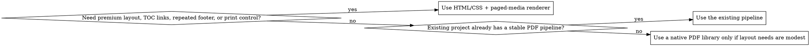

# Generate PDF Reports

## Overview

Turn source content into a report specification first, then render the PDF. Prefer HTML/CSS plus a paged-media renderer when visual quality, repeatable branding, navigation, and print layout control matter most.

## Workflow

### 1. Normalize the inputs

Collect or infer:

- report title
- audience
- brand name
- footer text
- logo or image assets
- raw text content
- structured metrics or datasets
- required sections
- delivery constraints

If key inputs are missing, make the smallest safe assumption and state it.

### 2. Build a report spec before designing

Translate the request into:

- cover metadata
- section order
- executive summary
- tables to render
- charts to render
- supporting images
- appendix content
- footer and pagination rules

Do not render charts from prose alone. If the data is qualitative or incomplete, use a table, callout, or ranked list instead.

### 3. Choose the renderer deliberately

Read `references/renderer-selection.md` when the runtime or renderer choice is unclear.

Default preference:

1. HTML/CSS + paged media
2. existing house renderer
3. native PDF libraries

### 4. Apply one visual system across the whole report

Read `references/design-system.md` before styling.

Use:

- light surfaces
- dark readable text
- soft restrained accents
- one chart palette
- one table style
- consistent spacing and type scale

Do not mix multiple visual languages in one PDF.

### 5. Assemble the report from reusable components

Read `references/report-components.md` when selecting layouts.

Standard order:

1. cover page
2. table of contents
3. executive summary
4. main sections
5. charts and tables near the related analysis
6. appendix

Include:

- logo or brand image on the cover or header area
- internal links from the TOC
- bookmark-friendly heading hierarchy
- page numbers
- brand text in the footer

Start from `assets/report-shell/report.html` and `assets/report-shell/styles.css` when the project does not already have a stronger house template.

### 6. Run a final PDF quality pass

Read `references/pdf-quality-checklist.md` before claiming the PDF is ready.

Always verify:

- TOC links
- bookmarks
- page numbers
- footer branding
- image clarity
- chart legibility
- table readability
- metadata completeness

## Quick Reference

| Need | Preferred move |
| --- | --- |
| Best visual quality | Use HTML/CSS + paged media |
| Only prose, no numeric data | Use summary blocks, callouts, or tables instead of charts |
| Consistent enterprise tone | Use the shared light-theme tokens from `references/design-system.md` |
| Large report | Add cover, TOC, bookmarks, appendix, and stable section IDs |
| Branding request | Place logo carefully and repeat brand name in the footer |
| Missing structure | Write a report spec before touching layout |

## Common Mistakes

- Starting layout work before defining the report structure
- Using saturated colors or dark-theme sections inside a light report
- Rendering decorative charts with weak or invented data
- Treating a visual TOC as a substitute for internal links or bookmarks
- Letting tables overflow or shrink until they are unreadable
- Forgetting repeating footer rules, page numbers, or brand text
- Claiming standards compliance without validating what the renderer actually supports
